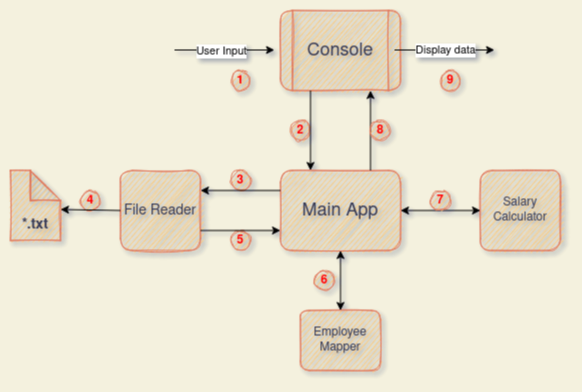

# IOET Employee Payment Exercise - README
## Solution Overview

ioet_employee_payment is a project developed for a job apply. This Console App shows the amount to be paid to an employee based on an given schedule.
This project could be written in any programming language. Python was used because its legibility, multi-paradigm support and simple usage, however.
The exercise asked to return a payment based on worked hours in a schedule by an employee. The next example was given:

>**Case 1**:
>
>INPUT:
>
>RENE=MO10:00-12:00,TU10:00-12:00,TH01:00-03:00,SA14:00-18:00,SU20:00-21:00
>
>OUTPUT:
>
>The amount to pay RENE is: 215 USD
>
>**Case 2**:
>
>INPUT:
>
>ASTRID=MO10:00-12:00,TH12:00-14:00,SU20:00-21:00
>
>OUTPUT:
>
>The amount to pay ASTRID is: 85 USD

Also, some game-rules were given, as shown below:
>Abbreviations:
>MO: Monday
>TU: Tuesday
>WE: Wednesday
>TH: Thursday
>FR: Friday
>SA: Saturday
>SU: Sunday

>Monday - Friday
>
>00:01 - 09:00 25 USD
>09:01 - 18:00 15 USD
>18:01 - 00:00 20 USD
>
>Saturday and Sunday
>
>00:01 - 09:00 30 USD
>09:01 - 18:00 20 USD
>18:01 - 00:00 25 USD

So, in this case, the first approach was to translate the given input into valid data to work with. To do that, an Employee Mapper was developed. This mapper validates and unwraps each data set provided.
The game rules mean that an employee's payment depends on the days worked and the hours between them. For that, a calculator was developed.
The calculator analyzes the given data by the mapper, compares days and schedules to return the amount of money to be paid to a certain employee.
Finally, a .txt file containing all data is the absolute input. This file contains all data sets to be analyzed. To read the data, a Reader was developed. This reader reads and extracts all datasets from the file and returns a list containing the data.

The solution approach uses functional programming because of its not-complex tasks and my lack of experience working with OOP. 

Some abstraction of SOLID principles were used to develop the app, trying to accomplish most of them. 
These are my considerations about accomplish of the principles:
1. (SRP) Each module has its responsibility.
2. (OCP) It can add more game rules and modules without losing the app functionality.
3. (DIP) Using enumerators to invert a module responsibility to a Class abstraction.

## Architecture

The project has some modules:
- Main app ([main.py](main.py))
- File Reader ([reader.py](./calculator/reader.py))
- Employee Mapper ([mapper.py](./calculator/mapper.py))
- Salary Calculator ([calc.py](./calculator/calc.py))

Each of these modules are related between themselves as the image shown below:

The numbers between connectors indicate different processes happening in the modules. These processes are:
1. The user inputs the directory and/or file name text to the console.
2. The input is returned to the Main app.
3. Main app calls File Reader to read the given input from the console.
4. File Reader opens and reads all information contained in the .txt file with the given input.
5. File Reader returns a list to Main App with the read data.
6. Main app calls Employee Mapper, who unwraps the data provided, validates it, and returns data to work with.
7. Main app calls Salary Calculator, which analyzes and compares the data given with the game rules. Then, the amount to be paid to a certain employee is returned to the Main app.
8. The employee's name and payment are given to the console.
9. The console displays the given data. 

## Compile and execution:
  **Requirements:**
  
 Last Python version in your computer. Use 3.9.7 version. [Link here](https://www.python.org/downloads/release/python-397/). Check your computer OS for the correct install option.

  **Instructions:**
 
- Download and install Python from the link given above. Check your operating system and select the right choice.
- Clone the repository in a directory of your computer via git commands or download directly as a zip file. If you downloaded it, unzip it.
- Now you can run the app via terminal or console.
- Open a terminal or console.
- Go via the `cd` command to the folder containing all the files containing the app.
- Write `python main.py` in the console to run the app.
- Then, press *Enter* to proceed to load a file into the app. If you have a *'.txt* file in the same directory of the app, you need to write the file name and extension, for example: *data.txt*. Otherwise, you will need to write a valid directory and file name like this: */home/pc/Downloads/data.txt*.
- You can try and enter *data.txt* to the app for seeing an example.

